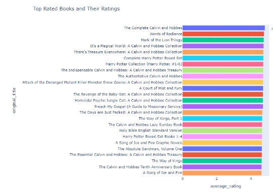

# Book_Heaven
Reading website with personalized recommendation and search.
it is a reading website that enables users to read publicly listed books, purchase paid books  through a link to external web sites, and add their previous readings from other websites such as goodreads.

# Website features
* Website has signup, log in and log out options. 
* Each user must declare 6 books (3 paid books and 3 free books) with their rates that he/she has already read before during signup operation to facilitate the recommendation system’s work at the beginning of the user journey on the website.
* Each user has an account with a unique email and username.
* Each user can upload his/her goodreads library to his/her account.
* Website shows recommended books for each user based on his/her previous preferred books and the similarity between him/her and the other users.
* Website shows some information about either open-source books or non open-source books such as authors, genres, description, average rating and purchase link for non-open-source books and number of downloads for open-source books. 
* For open-source books, each user can read them on the website, add them to his/her library, rate them from 1 to 5 and write a review about them.
* For non open-source books, each user can see the purchase link of them, add them to his/her library, rate them from 1 to 5 and write a review about them.

# data set
We have two datasets; one for paid books and the other one is for free books.
Paid books dataset
The following link contains the data set we used, which was collected from Goodreads API, when it was available to use (now it is no longer available): https://github.com/zygmuntz/goodbooks-10k
Free books dataset
The following link contains the data set we used, which was collected from Gutenberg project API Gutenberg API: https://gutendex.com/

## Paid books Dataset
### Data Description 
It consists of the files: ratings.csv, books.csv, book_tags.csv, and tags.csv. \
ratings.csv contains all users' ratings of the books (a total of 6 Million ratings, for 10,000 books, from 53,424 users).  \
books.csv contains information on the books such as author, average rating, etc. \
book_tags contains all tag_ids users have assigned to each book and corresponding tag_counts, while tags.csv contains the tag_names corresponding to the tag_ids. These two files are linked by the books’ ids. 

### Data visualization

### Data cleaning:
1. Books.csv doesn’t contain any duplicate books (checked the book title and authors columns for duplication). 
2. Ratings.csv doesn’t contain  duplicate user ratings for the same book (checked for duplications in the user_id and book_id columns), as one user can only give a single rating for a book. 
3.    Ratings.csv doesn’t contain any NaN values, and all the user_id and book_id are integers, and ratings are integers varying from 1 to 5. 
4. 53324 users gave more than 100 ratings, while 100 users gave less than 100 ratings, so we excluded the users with less than 100 ratings are dropped.

### Rating Normalization
Users ratings depend on whether the user is an optimist or a pessimist \
An optimist user will rate books that they enjoy 5, mediocre books 4, and books that they didn’t enjoy 3. \
While a pessimist user will rate their favourite books 3, mediocre books 2, and books that they didn’t enjoy 1. \
This variance in ratings will produce inaccurate results, so ratings normalization should be applied. \
The user’s rating of a book = user's original rating of the book - the average user’s ratings. \
This formula will normalize the ratings, so that no user’s optimism or pessimism affects the ratings. \

## Free books Dataset

### Data Description
It contains book titles, authors, subjects, formats,...etc. \

### Data correlation analysis and cleaning
Dropping the duplicate books with the same title and the same author. \
We then choose the highest 10000 books to work with according to downloads

# Recommendation Systems 

## Paid books Recommendation systems:
### First: Matrix Factorization:
This approach is based on converting the users, and books into embeddings, such that similar users will have similar user embeddings, and similar books will have similar book embeddings.

#### a) Collaborative filter Matrix Factorization model 1
#### Architecture
 
 
 

#### b) Collaborative filter Matrix Factorization model 2
##### Architecture:
 
 
 

### Fifth: Hybrid
Hybrid recommender combines different recommenders together to give better results, and to overcome the limitations of them. \
In this project, we will combine content-based recommender, and collaborative filtering recommender. \

The model consists of two main parts; part for content-based which takes book's features/genres, and part for collaborative filter which takes user's id and book's id. \

The inputs for the model are user's id, book's id (collaborative filter part), and book's features (content-based part). \

The target is rating. \

#### Hybrid model Architecture:

#### Training
We will use mean squared error as a metric to measure how good the
model is. \
I have used two techniques which are K-fold and hyperparameter tunning: 
##### K-fold
First: Split the data set into 3 groups \
Second: For each unique group: 
1. Take the group as a test data set. 
2. Take the remaining groups as a training data set. 
3. Fit a model on the training set and evaluate it on the test set. 
4. Retain the evaluation score. 

###### Mean squared error vs Epochs at different training folds:

##### Hyperparameter tuning
1. train with different hyperparameters.
2. choose the hyperparameters that give the best results. 
 

 

 

###### Mean squared error vs Epochs at best hyperparameters: 

